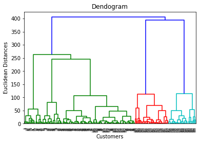

# Dendrogram

**Description of the tree:**
At the bottom line that means x-axis, we have all our customers and the vertical line (i.e. y-axis) are the Eucleadian distances between the clusters. The dendrogram represents all the different clusters that were found during the Hierarchical Clustering process.

# Dendrogram with Cutting Point

**Finding the optimal number of clusters:**
From the dendrogram, the largest distance that we can make vertically without the crossing any horinzontal line is the *Blue* one. If we draw a horizontal line as in the image, we'll get 5 clusters. That's exactly the same results we obtained in K-Means with the Elbow Method for *Mall Customers* dataset.

# Clusters of Clients

**Observation/Insight:**
1. *Cluster 1* have high income and low spending score. So, in this cluster clients earn a high income but don't spend much money So, this cluster of clients can be called as *Careful*.
2. Clients in *Cluster 2* have average income and average spending score. Thus, it can be labeled as *Standard*.
3. Clients in *Cluster 3* have high income and high spending score. So, that is the cluster of clients that would be the main potential target of the mall marketing campaigns. It would be very insightful for them all to understand what kind of products are bought by the clients in this cluster and more budgets may be allocated for those products. Hence, this cluster can be named as *Target*.

However, it's certainly needed to check the volume of the 2 clusters *Standard* and *Target*. Because, there's may be lot more customers in the *Standard* cluster which then would imply that the main revenue stream comes from the customers of *Cluster 3*. These are first insights we can get.

4. *Cluster 4* consists of clients who earn a low income but spend much. Therefore, can be called *Careless* customers. They might be young people who first got their salary and are so excited about that they can't resist spending their whole monthly salary in the mall.
5. As opposed to the clients who have low income but spends much, *Cluster 5* can be labeled as *Sensible*.

**After proper labeling of the cluster names, the Clusters of Clients chart will look like below:**

